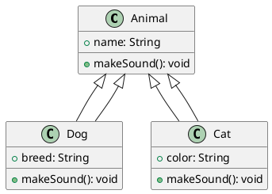
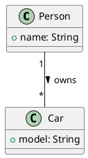
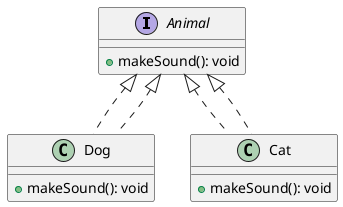
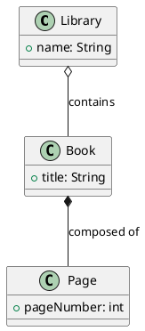
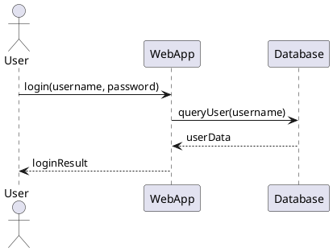

# UML Diagram Rules: Basics to Advanced

This guide covers the essential rules and best practices for creating UML diagrams, from basic to advanced concepts. Use this as a reference for drawing clear, consistent, and meaningful UML diagrams.

---

## 1. UML Diagram Basics

- **UML (Unified Modeling Language)** is a standard way to visualize the design of a system.
- **Common UML diagram types:**
  - Class Diagram
  - Sequence Diagram
  - Use Case Diagram
  - Activity Diagram
  - State Diagram
  - Component Diagram
  - Deployment Diagram

---

## 2. Class Diagram Rules

- **Classes:**
  - Represented as rectangles with three compartments: name, attributes, and methods.
  - Abstract classes are italicized or marked with `{abstract}`.
- **Attributes and Methods:**
  - `+` Public, `-` Private, `#` Protected, `~` Package
  - Example: `+name: String`, `-calculate(): int`
- **Relationships:**
  - **Association:** Solid line (optionally labeled)
  - **Inheritance (Generalization):** Solid line with a hollow triangle
  - **Realization (Interface):** Dashed line with a hollow triangle
  - **Aggregation:** Solid line with a hollow diamond
  - **Composition:** Solid line with a filled diamond
  - **Dependency:** Dashed line with an open arrow
- **Multiplicity:**
  - Shown at the ends of associations (e.g., `1`, `0..*`, `1..*`)
- **Notes:**
  - Use `note` elements to add explanations or constraints.

---

## 3. Sequence Diagram Rules

- **Lifelines:**
  - Represent objects/actors as rectangles with dashed lines below.
- **Messages:**
  - Solid arrows for calls, dashed for returns.
  - Label with method names and parameters.
- **Activation Bars:**
  - Thin rectangles on lifelines to show active execution.
- **Creation/Destruction:**
  - Object creation: arrow to new lifeline.
  - Destruction: `X` at end of lifeline.
- **Loops/Conditions:**
  - Use `alt`, `opt`, `loop` frames for alternatives, options, and loops.

---

## 4. Use Case Diagram Rules

- **Actors:**
  - Stick figures or named rectangles.
- **Use Cases:**
  - Ovals labeled with the use case name.
- **Relationships:**
  - Association: solid line
  - Include: dashed arrow with «include»
  - Extend: dashed arrow with «extend»

---

## 5. Activity Diagram Rules

- **Start/End:**
  - Start: filled circle; End: filled circle with border
- **Actions:**
  - Rounded rectangles
- **Decisions:**
  - Diamonds for branching
- **Flows:**
  - Arrows show control flow
- **Swimlanes:**
  - Vertical/horizontal lanes for responsibility

---

## 6. State Diagram Rules

- **States:**
  - Rounded rectangles
- **Transitions:**
  - Arrows labeled with events/conditions
- **Start/End:**
  - Same as activity diagrams

---

## 7. Advanced UML Concepts

- **Stereotypes:**
  - Use `<<stereotype>>` to add semantic meaning (e.g., `<<interface>>`, `<<abstract>>`)
- **Constraints:**
  - `{constraint}` in curly braces
- **Templates/Generics:**
  - Show parameterized classes with angle brackets (e.g., `List<T>`)
- **Packages:**
  - Group related classes; shown as tabbed folders
- **Visibility:**
  - Use `+`, `-`, `#`, `~` for public, private, protected, package
- **Refinement:**
  - Use notes and comments for clarification

---

## 8. Best Practices

- Keep diagrams simple and focused.
- Use consistent naming and notation.
- Avoid clutter—show only relevant details.
- Use notes for clarification.
- Follow standard UML notation for clarity and communication.

---

## 9. Example: Class Diagram (PlantUML)

---

## 10. Example Diagrams: Basic to Medium

### Example 1: Simple Association (Basic)

### Example 2: Inheritance and Interface (Basic)

### Example 3: Aggregation and Composition (Medium)

### Example 4: Sequence Diagram (Medium)

---

## References
- [UML 2.5 Specification](https://www.omg.org/spec/UML/2.5.1/)
- [PlantUML Documentation](https://plantuml.com/)
- [Mermaid Documentation](https://mermaid-js.github.io/mermaid/#/)
