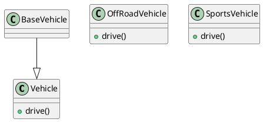
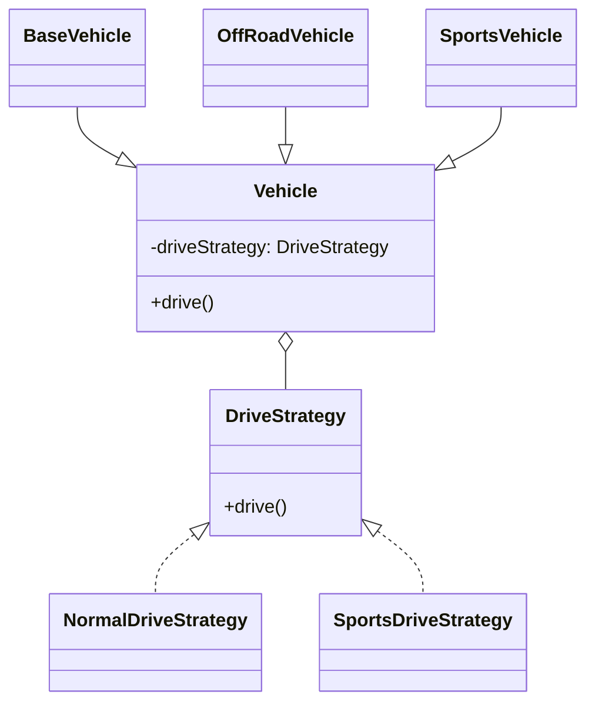

# Strategy Pattern

## What is the Strategy Pattern?

- The Strategy Pattern lets you choose different behaviors or algorithms at runtime.
- Each behavior is put in a separate class.
- You can switch behaviors easily without changing the main code.
- This helps avoid code duplication and makes your code flexible and easy to extend.

---

## Problem: Code Duplication in Drive Methods

Suppose you have a vehicle hierarchy without the Strategy Pattern. The `drive()` method is duplicated in each subclass, leading to code repetition and violating the DRY (Don't Repeat Yourself) principle.

```java
// Without Strategy Pattern (Code Duplication)
class Vehicle {
    public void drive() {
        System.out.println("Normal drive capability");
    }
}

class BaseVehicle extends Vehicle {
    // Inherits drive() from Vehicle
}

class OffRoadVehicle {
    public void drive() {
        System.out.println("Sports drive capability");
    }
}

class SportsVehicle {
    public void drive() {
        System.out.println("Sports drive capability");
    }
}
```

**Problem:**
- The `drive()` method is duplicated in `OffRoadVehicle` and `SportsVehicle`.
- If the drive logic changes, you must update it in multiple places.
- This violates the DRY principle and makes maintenance harder.

---

## Solution: Using the Strategy Pattern (DRY)

By applying the Strategy Pattern, you encapsulate the drive behavior in separate strategy classes and inject them into the vehicle classes. This removes duplication and makes the code flexible and maintainable.

```java
// Strategy interface
interface DriveStrategy {
    void drive();
}

// Concrete strategies
class NormalDriveStrategy implements DriveStrategy {
    public void drive() {
        System.out.println("Normal drive capability");
    }
}

class SportsDriveStrategy implements DriveStrategy {
    public void drive() {
        System.out.println("Sports drive capability");
    }
}

// Vehicle base class
class Vehicle {
    private DriveStrategy driveStrategy;
    public Vehicle(DriveStrategy driveStrategy) {
        this.driveStrategy = driveStrategy;
    }
    public void drive() {
        driveStrategy.drive();
    }
}

// Subclasses
class BaseVehicle extends Vehicle {
    public BaseVehicle() {
        super(new NormalDriveStrategy());
    }
}

class OffRoadVehicle extends Vehicle {
    public OffRoadVehicle() {
        super(new SportsDriveStrategy());
    }
}

class SportsVehicle extends Vehicle {
    public SportsVehicle() {
        super(new SportsDriveStrategy());
    }
}
```

**Explanation:**
- `Vehicle` is the parent class and uses a `DriveStrategy` interface.
- `BaseVehicle` uses `NormalDriveStrategy`.
- `OffRoadVehicle` and `SportsVehicle` both use `SportsDriveStrategy`.
- The drive behavior can be changed at runtime by passing a different strategy.

---

## UML Diagram: Code Duplication Example (Without Strategy Pattern)

> **Tip:** To preview this diagram, open `code-duplication-example.puml` in VS Code and use the PlantUML extension's preview feature.



## Strategy Pattern UML Diagram

### PlantUML
```plantuml
interface DriveStrategy {
  +drive()
}
class NormalDriveStrategy implements DriveStrategy
class SportsDriveStrategy implements DriveStrategy
class Vehicle {
  -driveStrategy: DriveStrategy
  +drive()
}
class BaseVehicle extends Vehicle
class OffRoadVehicle extends Vehicle
class SportsVehicle extends Vehicle

DriveStrategy <|.. NormalDriveStrategy
DriveStrategy <|.. SportsDriveStrategy
Vehicle o-- DriveStrategy
BaseVehicle --|> Vehicle
OffRoadVehicle --|> Vehicle
SportsVehicle --|> Vehicle
```

### Mermaid


This pattern promotes flexibility, reusability, and cleaner code by separating the algorithm from the context in which it is used.
